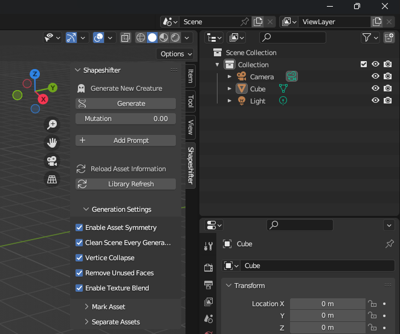
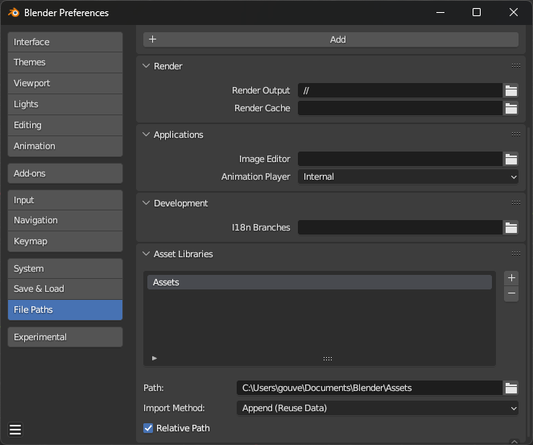
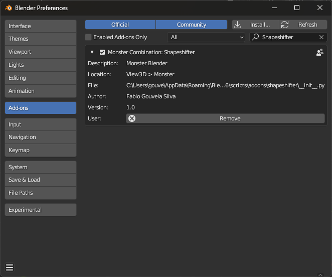

# Shapeshifter
The Shapeshifter addon is a versatile and innovative tool that goes beyond merely
generating meshes; it unlocks a realm of creativity and inspiration across various creative
domains. Beyond its applications in specific media, Shapeshifter catalyzes the birth of novel
ideas and fresh perspectives. By combining and recombining different parts, the addon
sparks creative thinking and encourages users to explore uncharted territories of design and
imagination. It is a catalyst for innovation, breaking barriers and redefining how we perceive
the boundaries of art and creation.

## 1. How to Install Shapeshifter in Blender

### Introduction
The Shapeshifter addon is a powerful tool for creating unique and imaginative creatures in Blender. This guide will walk you through the steps to install the Shapeshifter addon, enabling you to combine and recombine different parts to bring your creative visions to life.
### Step 1: Download the Shapeshifter Addon
To begin, download the Shapeshifter addon zip file from the following link:
https://github.com/gouveiafabio98/Shapeshifter/blob/main/addon/shapeshifter.zip
### Step 2: Verify Blender Installation
Before proceeding, make sure you have Blender installed on your computer.
For optimal compatibility, it's recommended to use the latest release version of Blender, ideally version 3.6 or higher.
### Step 3: Open Blender
Launch Blender on your computer.
### Step 4: Access the Preferences Menu
Locate the top menu bar within Blender's interface.
Click on "Edit" to open the dropdown menu.
Choose "Preferences" from the dropdown. This will open the Preferences window.
### Step 5: Navigate to the Add-ons Section
Inside the Preferences window, you'll find various tabs on the left.
Click on the "Add-ons" tab to manage and install addons.
### Step 6: Install the Shapeshifter Addon
In the Add-ons section, spot the "Install" button at the upper-right corner.
Click "Install" to initiate the addon installation process. A file dialog box will appear.
### Step 7: Select the Shapeshifter Addon Zip File
Use the file dialog box to navigate to where you've saved the downloaded Shapeshifter addon zip file.
Select the addon zip file by clicking on it once.
Once selected, hit the "Install" button at the bottom-right of the dialog box.
### Step 8: Enable the Addon
After successful installation, the Shapeshifter addon will be listed with a checkbox beside its name.
Enable the Shapeshifter addon by clicking on the checkbox next to its name. This will activate the addon.

</img>

Congratulations! You've now installed the Shapeshifter addon in Blender. This addon lets you bring your creative ideas to life by combining and recombining different parts to craft unique creatures.

## 2. How to Install a Pre-Created Library for the Shapeshifter Addon

### Introduction
To enhance your experience with the Shapeshifter add-on, you can install a pre-created library of assets that you can use for combining and recombining to create unique creatures. This guide will walk you through the steps to download, extract, and integrate the library into the Shapeshifter addon.
### Step 1: Download the Pre-Created Library
Click on the following link to download the pre-created library zip file: https://github.com/gouveiafabio98/Shapeshifter/blob/main/library/Assets.zip
### Step 2: Extract the Library
Locate the downloaded zip file on your computer.
Right-click on the zip file and choose "Extract" or "Extract All."
Choose a destination folder to extract the contents. For convenience, consider extracting the files to a location like "../Documents/Blender/Assets."
### Step 3: Open Blender
Launch Blender on your computer.
### Step 4: Access the Preferences Menu
Locate the top menu bar within Blender's interface.
Click on "Edit" to open the dropdown menu.
Choose "Preferences" from the dropdown. This will open the Preferences window.
### Step 5: Navigate to the File Paths Section
Inside the Preferences window, you'll find various tabs on the left.
Click on the "File Paths" tab and locate the "Asset Libraries" section.
### Step 6: Add New Asset Library
Click the "+" button to add a new asset library.
In the ‘Path’ option below, browse to the folder where you extracted the library (e.g., "../Documents/Blender/Assets") and select it.
Make sure the ‘Import Method’ is ‘Append (Reuse Data)’.
### Step 7: Start Creating with the Library
Now that the library is integrated, you can start using it with the Shapeshifter addon.
Open a new or existing Blender project.
Access the Shapeshifter addon and explore the newly added assets in your library.

</img>

Congratulations! You've successfully installed the pre-created library for the Shapeshifter addon. By following these steps, you've expanded your creative possibilities and can now use a wide variety of assets to craft imaginative creatures.

## 3. How to Generate a New Creature with the Shapeshifter Addon

### Introduction
The core functionality of the Shapeshifter addon lies in its ability to generate unique creatures by combining and recombining different parts from your asset library. This guide will take you through the process of creating a new creature using the addon's main interface and explaining the interactions available.
### Step 1: Accessing the Main Interface
Open Blender and ensure the Shapeshifter addon is enabled.
Locate the Shapeshifter panel in the sidebar of the Blender interface.

</img>

### Step 2: Main Generation Area
In the Shapeshifter panel, focus on the top area where the generation process is represented.
This area contains:
Generate Button: Clicking this button will place a new creature in the scene based on the current configurations and the asset library.
Mutation Slider: Adjust the mutation slider to influence the probability of using a random piece in the generation process.
Add Prompt Button: Click this button to add prompts that influence the creation process.
### Step 3: Generating a Creature
Configure your desired settings, including the mutation slider value.
Click the "Generate" button to create a new creature in the scene.
### Step 4: Adding Prompts
Use the "Add Prompt" button to add prompts that affect the creature's creation.
Each prompt consists of:
Prompt Text: Enter a description or instruction for the prompt.
Dropdown (Part Selection): Select the part of the creature that the prompt will influence.
Slider (Influence Power): Adjust the slider to set the strength of the prompt's influence on the selected part.
Trash Icon Button: Click this button to remove the prompt if needed.
Multiple prompts can be added to create complex and unique creatures.
### Step 5: Generation Settings (Optional)
There is a section named "Generation Settings" that provides additional configuration options:
Enable Asset Symmetry: Toggle to make creatures symmetric. Note that this doesn't work with mutated parts.
Clean Scene Every Generation: Toggle to remove old assets from the scene when generating a new creature.
Vertice Collapse: Toggle to join mesh vertices.
Remove Unused Faces: Toggle to remove unnecessary connection faces.
Enable Texture Blend: Toggle to enable texture blending between assets.
Library Refresh: Use this button to update the dropdowns if they appear outdated or incomplete.

Congratulations! You've successfully learned how to generate a new creature using the Shapeshifter addon. Experiment with different settings, prompts, and configurations to bring your creative visions to life.
